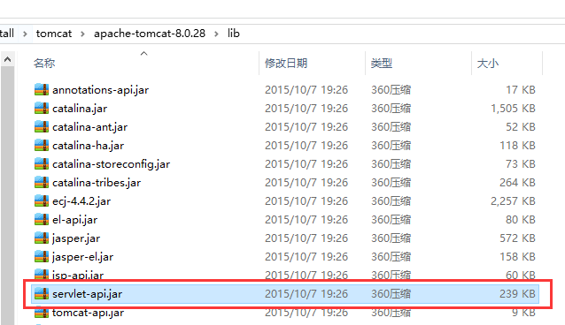

出现这个错误是因为Weblogic的版本低于12c。12c版本以下的Weblogic容器提供的servlet-api低于3.0，而咱们发布的后台基本都是3.0的。所以修复这个问题很简单，改成2.5就可以发布了。如下修改web.xml 中根节点属性即可。

**修改前:**
```
<?xml version="1.0" encoding="UTF-8"?>
<web-app version="3.0" 
    xmlns="http://java.sun.com/xml/ns/javaee" 
    xmlns:xsi="http://www.w3.org/2001/XMLSchema-instance" 
    xsi:schemaLocation="http://java.sun.com/xml/ns/javaee
    http://java.sun.com/xml/ns/javaee/web-app_3_0.xsd">
```
**修改后:**
```
<?xml version="1.0" encoding="UTF-8"?>
<web-app version="2.5" 
    xmlns="http://java.sun.com/xml/ns/javaee" 
    xmlns:xsi="http://www.w3.org/2001/XMLSchema-instance" 
    xsi:schemaLocation="http://java.sun.com/xml/ns/javaee
    http://java.sun.com/xml/ns/javaee/web-app_2_5.xsd">
```
修改完成后，重新部署就可以了。

题外话，servlet-api这个jar包由容器而非jdk提供。容器是指tomcat、jboss、weblogic 这些应用程序服务器，定位到**tomcat_home/lib**目录，你就能看到servlet-api.jar 这个文件，如下：



这里没办法知道此tomcat提供的是哪个版本的servlet-api，需要打开此jar包，定位到/META-INF/MANIFEST.MF文件，打开可看到如下内容：
```
Manifest-Version: 1.0
Ant-Version: Apache Ant 1.9.6
Created-By: 1.7.0_80-b15 (Oracle Corporation)
X-Compile-Source-JDK: 1.7
X-Compile-Target-JDK: 1.7

Name: javax/servlet/
Specification-Title: Java API for Servlets
Specification-Version: 3.1
Specification-Vendor: Sun Microsystems, Inc.
Implementation-Title: javax.servlet
Implementation-Version: 3.1.FR
Implementation-Vendor: Apache Software Foundation
```
从上面可以看到，我这个Tomcat7提供的是3.1的版本。因此，咱们的后台如果用Tomcat7或8来部署，不用考虑此问题，因为咱们的基线里web.xml写的是3.0。如果有一天在web.xml里面写的版本高于了容器实际提供的版本，那么就会出现部署的问题了。

**注意**：如果开发时使用高版本servlet-api，而部署却使用低版本servlet-api，那就可能会出现缺少相应api的情况。高版本肯定会在低版本的基础上添加一些额外功能。比如我就因此遇到过[上传报NoSuchMethodError](./weblogic-servlet-request-error.md)的问题，请大家注意。

**参考文档:**
- [http://docs.oracle.com/cd/E24329_01/web.1211/e24494/toc.htm#NOTES260](http://docs.oracle.com/cd/E24329_01/web.1211/e24494/toc.htm#NOTES260)